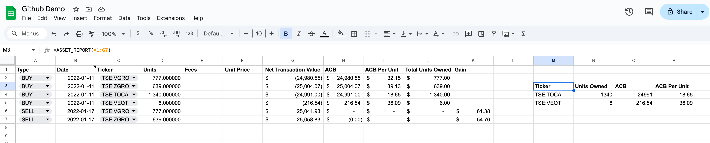
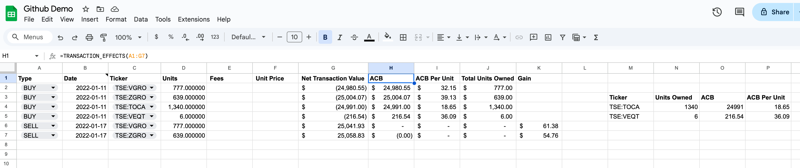

# Google Sheets ACB

## Intro

This project contains Google Apps Script code for adding custom functions to Google Sheets that can
help with bookkeeping for non-registered account trades. Particularly, these functions can help with
tracking the adjusted cost base (ACB), total units owned, sale gains, and other useful information
needed when filing your taxes.

### Functions

Once built and deployed, you will have access to these custom functions in your Google Sheet:

- `=ACB_UNIT("TSE:VEQT", A1:H100)` -> Returns the ACB per unit for the given ticker.
- `=UNITS_OWNED("TSE:VEQT", A1:H100)` -> Returns the total units owned for the given ticker.
- `=ASSET_REPORT(A1:H100)` -> Returns a table containing the final asset report for all tickers. This report
  shows the final ACB, ACB per unit, units owned, and pending capital gain for the current calendar year
  after applying all the transactions in the dataset.
- `=TRANSACTION_EFFECTS(A1:H100)` -> Returns a table containing the effects of each transaction (ordered). Each effect includes the
  post-transaction ACB, ACB per unit, updated total units owned, and gain/loss (if applicable). The output table has the same number
  of rows as the input data, matching the input 1:1.




### Expected sheet layout

The data range passed to all of the above functions must include a header row with these titles (order can vary; extra columns are ok; case-insensitive):

- `Date`
- `Ticker`
- `Type`
- `Units`
- `Unit Price`
- `Fees`
- `Net Transaction Value`

Supported transaction types: `BUY`, `SELL`, `TRF_IN`, `TRF_OUT`, `DRIP`, `STK_RWD`, `NCDIS`, `ROC`.

Transaction rows can be:

- Components provided: Units + Unit Price (+ Fees optional), NTV optional (validated if present).
- Derived components: Units + NTV, or Unit Price + NTV (the missing piece is derived).
- Net-only rows: only NTV for `NCDIS` and `ROC`.

NTV sign conventions:

- BUY as negative
- SELL as positive
- TRF_IN as positive
- TRF_OUT as negative
- STK_RWD as positive
- DRIP as negative
- NCDIS as positive
- ROC as positive

## Build and Install

1. Clone and install:

```
git clone <repo-url>
cd google_sheets_acb
yarn install
```

> [!TIP]
> You can skip local cloning/building by downloading the `Code.gs` release artifact
> from the GitHub Releases page for the tag you want.

2. Build the Apps Script bundle:

```
yarn build
```

3. Deploy to Google Apps Script:

- Open the Apps Script project for your Google Sheet.
- Paste `build/Code.gs` into the editor (single file).
- Save, then use the custom functions in Google Sheets.

## Contributing and Build Pipeline

- Source of truth lives in `src/` as TypeScript ESM.
- `scripts/build_gas.js` bundles `src/main.ts` with esbuild (IIFE output).
- The build script parses `src/main.ts` to find named exports and appends
  top-level wrapper functions so GAS detects custom functions.
- Only exports from `src/main.ts` are exposed to Sheets; other modules stay internal.

Useful commands:

- `yarn test`: run Jest tests.
- `yarn lint`: run ESLint.
- `yarn build`: generate `build/Code.gs` for GAS.
