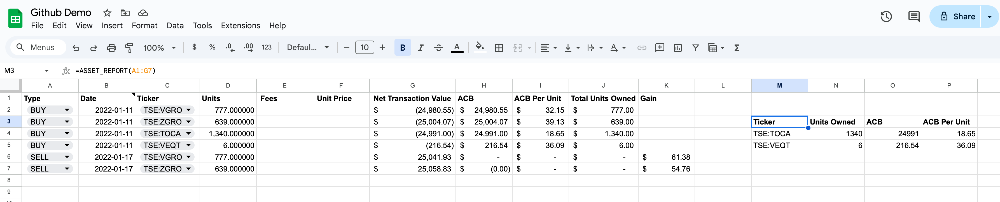
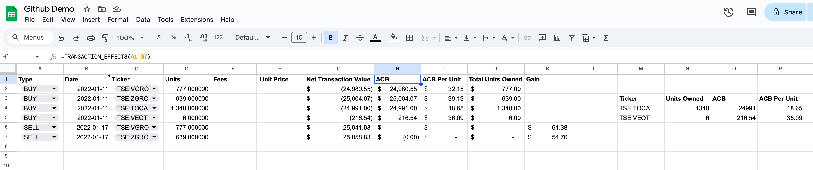

# Google Sheets ACB

## Intro

This project contains Google Apps Script code for adding custom functions to Google Sheets that can
help with bookkeeping for non-registered account trades. Particularly, these functions can help with
tracking the adjusted cost base (ACB), total units owned, sale gains, and other useful information
needed when filing your taxes.

### Functions

Once built and deployed, you will have access to these custom functions in your Google Sheet:

- `=ACB_UNIT("TSE:VEQT", A1:H100)` -> Returns the ACB per unit for the given ticker.
- `=UNITS_OWNED("TSE:VEQT", A1:H100)` -> Returns the total units owned for the given ticker.
- `=UNITS_OWNED_ON("TSE:VEQT", DATE(2024, 12, 31), A1:H100)` -> Returns units owned across
  accounts for the given ticker at or before the supplied date. The date can also be a date cell reference.
- `=ASSET_REPORT(A1:H100)` -> Returns a table containing the final asset report for all tickers. This report
  shows the final ACB, ACB per unit, and units owned for all the tickers after applying all the transactions in the dataset.
- `=TRANSACTION_EFFECTS(A1:H100)` -> Returns a table containing the effects of each transaction (ordered). Each effect includes the
  signed ACB change, post-transaction ACB, ACB per unit, updated total units owned, and gain/loss (if applicable). The output
  table has the same number of rows as the input data, matching the input 1:1.




### Units owned on a date

`UNITS_OWNED_ON(ticker, date, data)` includes transactions at the cutoff and excludes later
transactions and other tickers. It returns `0` when there are no matching transactions or the
position has been fully sold. Unlike `UNITS_OWNED`, it reports holdings at the cutoff rather
than at the end of the dataset.

The cutoff compares exact timestamps: if transaction cells include times, a date at midnight
does not include later transactions that day. Blank rows are ignored, but the entire remaining
table must contain valid transaction rows in chronological order, including other tickers and
transactions after the cutoff. Rows with the same timestamp are processed in input order.

### Expected sheet layout

The data range passed to all of the above functions must include a header row with these titles (order can vary; extra columns are ok; case-insensitive):

- `Date`
- `Ticker`
- `Type`
- `Units`
- `Unit Price`
- `Fees`
- `Net Transaction Value`

Supported transaction types: `BUY`, `SELL`, `TRF_IN`, `TRF_OUT`, `DRIP`, `STK_RWD`, `NCDIS`, `ROC`.

Transaction rows can be:

- Components provided: Units + Unit Price (+ Fees optional), NTV optional (validated if present).
- Derived components: Units + NTV, or Unit Price + NTV (the missing piece is derived).
- Net-only rows: only NTV for `NCDIS` and `ROC`.

NTV sign conventions:

- BUY as negative
- SELL as positive
- TRF_IN as positive
- TRF_OUT as negative
- STK_RWD as positive
- DRIP as negative
- NCDIS as positive
- ROC as positive

## Build and Install

1. Clone and install:

```
git clone <repo-url>
cd google_sheets_acb
yarn install
```

> [!TIP]
> You can skip local cloning/building by downloading the `Code.gs` release artifact
> from the GitHub Releases page for the tag you want.

2. Build the Apps Script bundle:

```
yarn build
```

3. Deploy to Google Apps Script:

- Open the Apps Script project for your Google Sheet.
- Paste `build/Code.gs` into the editor (single file).
- Save, then use the custom functions in Google Sheets.

## Contributing and Build Pipeline

- Source of truth lives in `src/` as TypeScript ESM.
- `scripts/build_gas.js` bundles `src/main.ts` with esbuild (IIFE output).
- The build script parses `src/main.ts` to find named exports and appends
  top-level wrapper functions so GAS detects custom functions.
- Only exports from `src/main.ts` are exposed to Sheets; other modules stay internal.

Useful commands:

- `yarn test`: run Jest tests.
- `yarn lint`: run ESLint.
- `yarn build`: generate `build/Code.gs` for GAS.

## License

[ISC License](https://choosealicense.com/licenses/isc/)

```
THE SOFTWARE IS PROVIDED "AS IS" AND THE AUTHOR DISCLAIMS ALL WARRANTIES WITH
REGARD TO THIS SOFTWARE INCLUDING ALL IMPLIED WARRANTIES OF MERCHANTABILITY
AND FITNESS. IN NO EVENT SHALL THE AUTHOR BE LIABLE FOR ANY SPECIAL, DIRECT,
INDIRECT, OR CONSEQUENTIAL DAMAGES OR ANY DAMAGES WHATSOEVER RESULTING FROM
LOSS OF USE, DATA OR PROFITS, WHETHER IN AN ACTION OF CONTRACT, NEGLIGENCE OR
OTHER TORTIOUS ACTION, ARISING OUT OF OR IN CONNECTION WITH THE USE OR
PERFORMANCE OF THIS SOFTWARE.
```

Or, in my own words: **I am not an accountant. I am not a tax lawyer. I am definitely not _your_ accountant or _your_ tax lawyer. This program is useful to me and I am making it public because it may be useful to others but I do not warrant _in any way_ that it will compute the correct results for any particular situation (particularly esoteric situations).**
